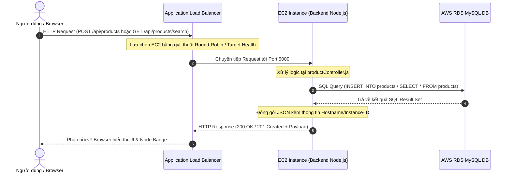

# 🏗️ CloudAutoScale - Chi Tiết Kiến Trúc & Luồng Xử Lý (Architecture & Request Flow)

Tài liệu này mô tả chi tiết thiết kế hạ tầng điện toán đám mây AWS, các lớp mạng VPC, cơ chế phân phối tải (ALB), tự động mở rộng (Auto Scaling), cơ sở dữ liệu RDS và luồng di chuyển của dữ liệu trong dự án **CloudAutoScale**.

---

## 📐 1. Sơ Đồ Kiến Trúc Hạ Tầng Mạng (Network & Cloud Architecture)

Hệ thống được thiết kế theo các thực hành tốt nhất về bảo mật của AWS (AWS Security Best Practices), chia làm 3 vùng mạng:

```text
==========================================================================================
                                   AWS CLOUD REGION (ap-southeast-1)
==========================================================================================
                                       VPC (10.0.0.0/16)
------------------------------------------------------------------------------------------
 [Public Subnet 1 (10.0.1.0/24)]              [Public Subnet 2 (10.0.2.0/24)]
  (Availability Zone A)                        (Availability Zone B)
  ┌──────────────────────────┐                 ┌──────────────────────────┐
  │ Application Load Balancer│ ◄──────────────►│ Application Load Balancer│
  │        (Public ALB)      │                 │        (Public ALB)      │
  └─────────────┬────────────┘                 └─────────────┬────────────┘
                │                                            │
================┼============================================┼============================
                │ (Internal Traffic: Port 5000)              │
----------------┼--------------------------------------------┼----------------------------
 [Private Subnet 1 (10.0.10.0/24)]            [Private Subnet 2 (10.0.11.0/24)]
  (AZ A - App Tier)                            (AZ B - App Tier)
  ┌──────────────────────────┐                 ┌──────────────────────────┐
  │ EC2 Instance Backend #1  │                 │ EC2 Instance Backend #2  │
  │ (Node.js Express API)    │                 │ (Node.js Express API)    │
  └─────────────┬────────────┘                 └─────────────┬────────────┘
                │                                            │
                └──────────────────────┬─────────────────────┘
                                       │ SQL Query (Port 3306)
---------------------------------------┼--------------------------------------------------
 [Private Subnet DB 1 (10.0.20.0/24)]  │       [Private Subnet DB 2 (10.0.21.0/24)]
  (AZ A - Database Tier)               ▼        (AZ B - Database Tier)
  ┌──────────────────────────────────────────────────────────────────────┐
  │                        AWS RDS MySQL (Multi-AZ)                      │
  └──────────────────────────────────────────────────────────────────────┘
------------------------------------------------------------------------------------------
 [Management & Scaling Components]
  - AWS Auto Scaling Group (Min: 1, Desired: 1, Max: 4)
  - AWS CloudWatch Alarms (High CPU > 70%, Low CPU < 30%)
==========================================================================================
```

---

## 🔄 2. Phân Tích Luồng Xử Lý Nghiệp Vụ (Detailed Sequence Flow)

### 2.1. Luồng Tương Tác Giữa Các Thành Phần (HTTP Lifecycle)



---

## ⚡ 3. Cơ Chế Auto Scaling & Cân Bằng Tải (Load Balancing & Auto Scaling Logic)

### 3.1. Cấu Hình Application Load Balancer (ALB)
- **Listener**: Lắng nghe cổng `80 (HTTP)`.
- **Target Group**: Định tuyến lưu lượng vào cổng `5000 (HTTP)` của các EC2 Instance có trạng thái `Healthy`.
- **Health Check Path**: `/healthcheck`
  - Thơi gian kiểm tra: Mỗi 15 giây.
  - Ngưỡng Healthy: 2 lần thành công liên tiếp.
  - Ngưỡng Unhealthy: 3 lần thất bại liên tiếp.

### 3.2. Cấu Hình Auto Scaling Group (ASG)
- **Dung lượng tối thiểu (Min Size)**: 1 Instance.
- **Dung lượng mong muốn (Desired Capacity)**: 1 Instance.
- **Dung lượng tối đa (Max Size)**: 4 Instance.
- **Subnets**: Nằm ở các Private Subnets phân bố trên nhiều AZs (Multi-AZ) để đảm bảo High Availability (HA).

### 3.3. Chính Sách Auto Scaling (Target Tracking Scaling Policy)
1. **Scale-Out Policy (Tăng tài nguyên)**:
   - **Chỉ số theo dõi**: `CPUUtilization` của ASG.
   - **Điều kiện kích hoạt**: Khi `CPUUtilization > 70%` duy trì trong 60 giây.
   - **Hành động**: Auto Scaling Group gọi EC2 API để khởi tạo thêm 1 máy chủ EC2 mới dựa trên **Launch Template**. Khi máy chủ vượt qua Health Check, ALB tự động thêm vào Target Group để nhận bớt lưu lượng.
2. **Scale-In Policy (Thu hẹp tài nguyên)**:
   - **Chỉ số theo dõi**: `CPUUtilization` của ASG.
   - **Điều kiện kích hoạt**: Khi `CPUUtilization < 30%` duy trì trong 300 giây (5 phút).
   - **Hành động**: Auto Scaling Group chấm dứt (Terminate) máy chủ EC2 dư thừa, đưa số lượng máy chủ về lại mốc Desired (1 Instance).

---

## 🔒 4. Cấu Hình Security Groups (Bảo Mật Mô Hình 3 Lớp)

Dự án áp dụng mô hình phân vùng bảo mật nghiêm ngặt thông qua AWS Security Groups:

| Security Group | Inbound Rules (Quyền Vào) | Outbound Rules (Quyền Ra) | Mục Đích |
|---|---|---|---|
| **ALB-SG** | Allow HTTP (80) từ `0.0.0.0/0` | Allow ALL tới `EC2-SG` | Nhận request công cộng từ Internet |
| **EC2-SG** | Allow HTTP (5000) từ `ALB-SG` | Allow ALL tới Internet & `RDS-SG` | Chỉ nhận request đến từ ALB, ngăn truy cập trực tiếp từ ngoài |
| **RDS-SG** | Allow MySQL (3306) từ `EC2-SG` | Deny ALL | Chỉ cho phép các EC2 Backend truy vấn Database |

---

## 🗄️ 5. Sơ Đồ Cơ Sở Dữ Liệu MySQL trên AWS RDS

Bảng `products` được khởi tạo tự động trên AWS RDS MySQL:

```sql
CREATE TABLE IF NOT EXISTS products (
    id INT AUTO_INCREMENT PRIMARY KEY,
    name VARCHAR(255) NOT NULL,
    price DECIMAL(10, 2) NOT NULL,
    description TEXT,
    stock INT DEFAULT 0,
    category VARCHAR(100),
    created_at TIMESTAMP DEFAULT CURRENT_TIMESTAMP,
    updated_at TIMESTAMP DEFAULT CURRENT_TIMESTAMP ON UPDATE CURRENT_TIMESTAMP,
    INDEX idx_name (name)
) ENGINE=InnoDB DEFAULT CHARSET=utf8mb4;
```
